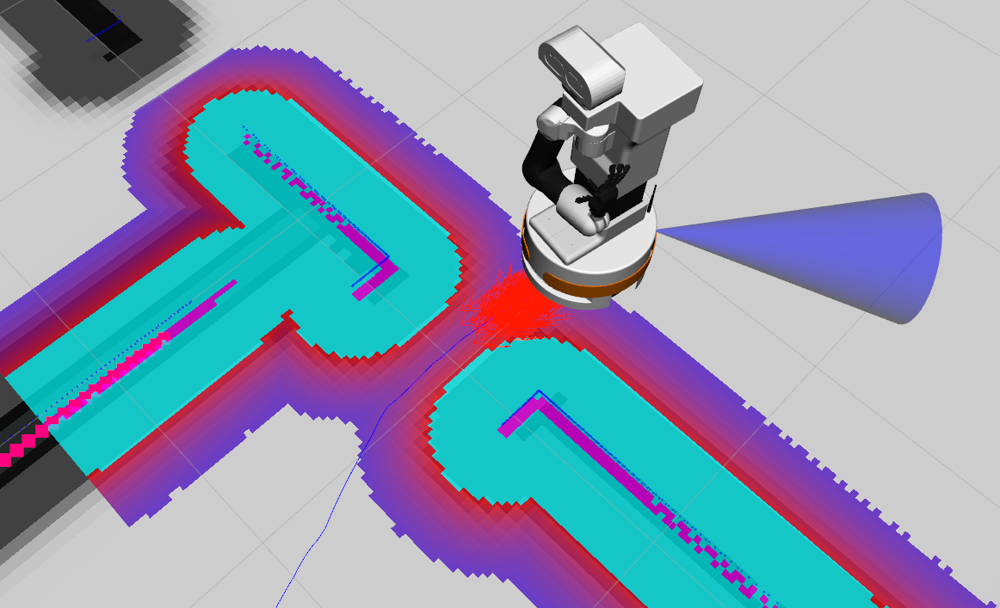

# Door Problem Workspace

This repository contains everything needed to simulate The Door Problem™.



> the robot is stuck

## Run with Docker

Prerequisities to install:

- [aur/nvidia-docker](https://aur.archlinux.org/packages/nvidia-docker) or `arch4edu/nvidia-docker`
- [aur/python-rocker](https://aur.archlinux.org/packages/python-rocker)

This is all you need to get up and running:

```bash
# save information about CWD
# needed for localisation in next steps
export MAP_LOCATION=$PWD/configurations/cleaned

# you may want to start roscore outside of the container before continuing
ros
roscore &

# run the container
rocker -e MAP_LOCATION=$MAP_LOCATION --volume "./src/door_world/worlds/door_world.xml":"/tiago_public_ws/src/tiago_simulation/tiago_gazebo/worlds/door_world.world" --volume "./src/door_world/meshes/door_world.dae":"/tiago_public_ws/src/tiago_simulation/tiago_gazebo/meshes/door_world.dae" --home --user --nvidia --x11 --privileged --network=host palroboticssl/tiago_tutorials:melodic

# setup environment
pushd /tiago_public_ws
source ./devel/setup.bash
popd

# launch default map with nothing else
# roslaunch tiago_gazebo tiago_gazebo.launch public_sim:=true world:=door_world

# launch with localised map
roslaunch tiago_2dnav_gazebo tiago_navigation.launch public_sim:=true world:=door_world map:=$MAP_LOCATION

# this should require no extra localisation
# steps since transformation is the same!

# 1. if you run into issues, force localise by running:
rosservice call /global_localization "{}"
# 2. then move the robot around:
TERM=linux rosrun key_teleop key_teleop.py
# 3. and reset costmaps after it finds where it is
rosservice call /move_base/clear_costmaps "{}"
```

For use with above, a `door_world.geojson` file is included with information about positions of different things.

## Mapping (for reference only)

To map the world, launch the mapping tools:

```bash
# launch
roslaunch tiago_2dnav_gazebo tiago_mapping.launch public_sim:=true world:=door_world

# move the robot around a bit (in another terminal or CTRL+Z)
# use this teleop if you hate yourself
TERM=linux rosrun key_teleop key_teleop.py

# once sufficiently mapped, save the map
rosservice call /pal_map_manager/save_map "directory: ''"

# this updates ~/.pal/tiago_maps/config by default
ls -la ~/.pal/tiago_maps/config

# you can copy out the configuration from the default directory
ls -la ~/.pal/tiago_maps/configurations
```

## Demo Video

This is a video of the robot struggling to get through the "door".

https://user-images.githubusercontent.com/38285861/203162071-9caabb98-d5f6-4f39-920f-da5783dbddec.mp4
